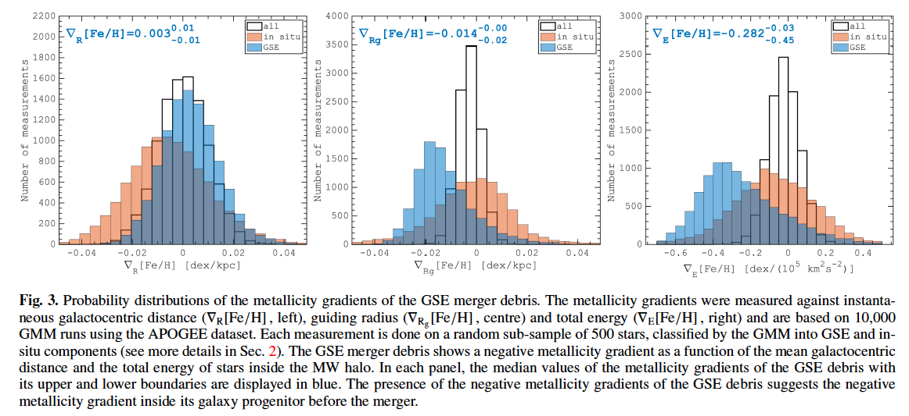

## Oct.9, Mon
#### [Dead man tells tales: metallicity distribution of the Milky Way stellar halo reveals the past of the GSE progenitor galaxy](https://arxiv.org/abs/2310.05287)
- 用Gaussian mixture model (GMM)证认经过金属丰度筛选的APOGEE DR17星，算出每颗星属于GSE的概率。

- 这些GSE星中金属丰度相对瞬时银心距的梯度并不显著，但相对平均银心距有一个比较低但统计显著的梯度-0.014dex/kpc。**更有信息的是金属丰度相对于total energy的梯度。***（原因:In a situation where we lack a large coverage of the halo tracers, using integrals of motion, particularly the total energy (E), as a parameter to measure the metallicity gradient is indeed a more fundamental approach. As discussed in the introduction, several theoretical studies predict a systematic increase in the mean metallicity of stars with decreasing total energy.）*显示了能量越低的星倾向于有较高的金属丰度。

- N-body simulation给出galaxy的金属丰度梯度与其merger debris的金属丰度梯度的关系，限制出GSE的progenitor的金属丰度梯度~-0.1dex/kpc。这个值很像观测到的近邻年老矮星系，但GSE的progenitor比这些矮星系massive得多，这表明**GSE progenitor的大质量对其演化历史有显著影响**。

#### [Seeding the CGM: How Satellites Populate the Cold Phase of Milky Way Halos](https://arxiv.org/abs/2310.04404)

## Oct.10, Tues
#### [Low-mass globular clusters from stripped dark matter halos](https://arxiv.org/abs/2310.03790)

#### [Identifying the possible ex-situ origin of the globular clusters of the Milky Way: A kinematic study](https://arxiv.org/abs/2310.04492)

#### [HALOFLOW I: Neural Inference of Halo Mass from Galaxy Photometry and Morphology](https://arxiv.org/abs/2310.04503)

#### [Galactic Archaeology with [Mg/Mn] versus [Al/Fe] abundance ratios -- Uncertainties and caveats](https://arxiv.org/abs/2310.04530)